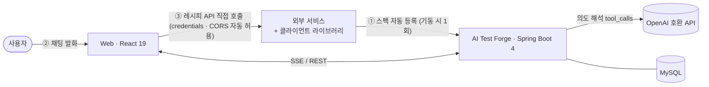
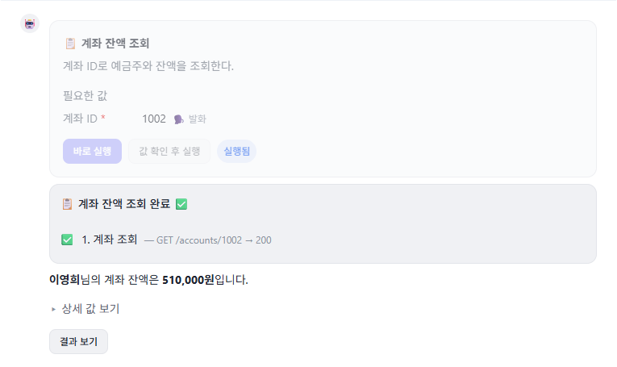
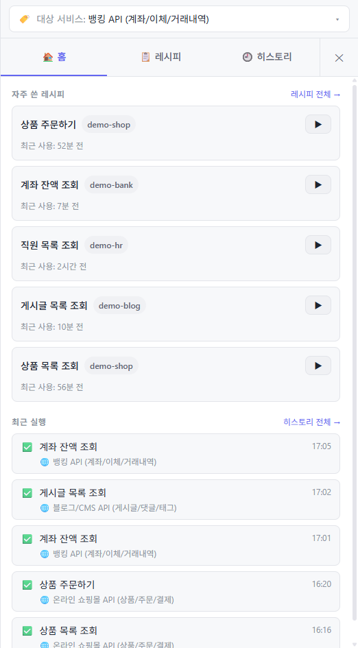
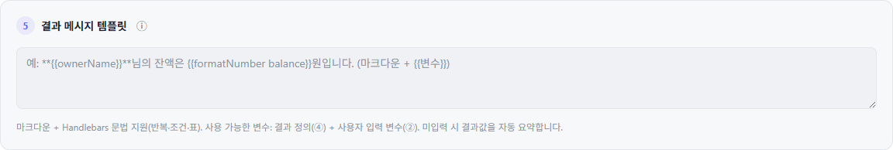

<div align="center">

# ⚡ AI Test Forge

**채팅으로 API 워크플로우를 실행해 테스트 데이터를 만드는 AI 플랫폼**

자연어로 "회원가입 5건 만들어줘"라고 하면, AI가 의도를 해석해 알맞은 레시피를 실행하고 결과를 마크다운으로 보여준다.

`Java 25` · `Spring Boot 4` · `React 19` · `MySQL` · `OpenAI 호환 API`

</div>

---

## 📑 목차

- [한눈에 보기](#-한눈에-보기)
- [아키텍처](#-아키텍처)
- [동작 원리](#-동작-원리)
- [핵심 화면](#-핵심-화면)
- [모노레포 구조](#-모노레포-구조)
- [빠른 시작](#-빠른-시작)
- [클라이언트 라이브러리](#-클라이언트-라이브러리)
- [설계 결정과 근거](#-설계-결정과-근거)
- [문서](#-문서)

---

## 🔎 한눈에 보기

- **채팅 → 실행 → 결과**: 자연어 발화를 AI가 tool로 해석해(1회 호출) 레시피를 실행한다.
- **스펙 자동 등록**: 외부 서비스는 클라이언트 라이브러리만 붙이면 OpenAPI 스펙이 자동 등록되고 CORS가 열린다(코드 수정 최소).
- **브라우저 실행**: 실제 API 호출은 **사용자 브라우저(FE)** 에서 일어난다 — 외부 서버의 로그인 세션을 그대로 활용하고 BE 프록시를 피하기 위함.
- **마크다운 결과**: 실행 결과는 BE가 Handlebars 템플릿으로 1회 렌더한 마크다운을 저장하고, FE는 렌더만 한다(표·강조·XSS 방어).

---

## 🏗️ 아키텍처



- **① 스펙 등록** — 외부 서비스가 라이브러리를 붙이면 기동 시 OpenAPI를 BE에 자동 등록 + CORS 허용.
- **② 채팅** — 사용자 발화를 BE가 AI로 해석해 실행 카드/플랜/안내로 응답.
- **③ 실행** — 사용자가 카드에서 실행하면 **FE 브라우저가 외부 API를 직접 호출**한다. 이렇게 하는 이유: 외부 서버의 사용자 로그인 세션(쿠키)을 그대로 쓰고, BE가 모든 트래픽을 프록시하는 부담·보안 위험을 피하기 위해서다. 스텝 결과만 BE에 보고되어 저장·재개·히스토리에 쓰인다.

| 작업 | 호출 주체 |
|------|----------|
| 레시피 API 실행 | **FE 브라우저** (외부 서버 직접 호출, CORS 자동 허용) |
| 정보 조회(investigate) | **BE** (서버 시크릿 토큰으로 Confluence 등 조회) |

> **AI 호출은 Spring AI를 쓰지 않는다.** OpenAI 호환 Chat Completions API를 Spring `RestClient`로 직접 호출하고 `tool_calls`를 직접 파싱한다(OpenAI·OpenRouter 공통). 확장 경계는 `IntentResolver` 인터페이스이며, 키 미설정 시 규칙 기반 목으로 폴백한다.

---

## ⚙️ 동작 원리

<details open>
<summary><b>1. 스펙 자동 등록 (라이브러리 → BE)</b></summary>

의존성 + 설정만 추가하면 자동 동작한다(코드 수정 없음).

- 앱 기동 시 OpenAPI 스펙 수집 → AI Test Forge로 전송(기동당 1회, 재기동 시 최신 스펙 재등록).
- AI Test Forge 도메인을 CORS 허용 오리진에 자동 등록(FE 직접 호출 대비).
- 어노테이션으로 API별 제어: `@TestForgeExclude`(등록 제외, 예: 로그인 API), `@TestForgeConfirm`(파괴적 작업 실행 전 확인).

가이드: [docs/library/README.md](docs/library/README.md) · [스펙 등록 방식](docs/specs/spec/registration.md)
</details>

<details>
<summary><b>2. 채팅 레시피 실행 (Tool Use 패턴)</b></summary>

- 발화 → BE가 OpenAI 호환 API를 **1회 호출**해 의도 분석 + tool 선택을 동시에(별도 분류 단계 없음).
- tool 7종: `execute_recipe` / `propose_plan` / `select_service` / `show_candidates` / `clarify` / `no_match` / `chat`.
- 실행 카드에서 [바로 실행]/[값 확인 후 실행]을 고르면 FE가 스텝을 순차 실행하고 결과를 BE에 보고.
- 진행/결과는 커스텀 이벤트가 아니라 **채팅 메시지(PROGRESS/RESULT 파트)** 로 저장되어 새로고침에도 복원된다. 실행을 촉발한 카드와 진행·결과는 **한 턴(아바타 1개)** `[CARD, PROGRESS, RESULT]`로 묶인다.
- 할루시네이션 금지: 모르면 `clarify`, 없으면 `no_match`.
</details>

<details>
<summary><b>3. 결과 메시지 렌더 (BE Handlebars → 마크다운 → FE)</b></summary>

- 결과 메시지 템플릿(⑤)은 마크다운 + Handlebars로 작성한다(값 `{{key}}`, 반복 `{{#each}}`, 조건 `{{#if}}`, 헬퍼 `formatNumber`/`eq`/`gt`/`lt`/`default`).
- 실행 완료 시 **BE가 1회 렌더**해 마크다운 문자열을 결과 `content`로 저장(FE는 렌더만 — 여러 탭/재조회/히스토리 동일).
- FE는 `react-markdown` + `remark-gfm`(표) + `rehype-sanitize`(XSS 방어)로 렌더. 원본 값(`resultValues`)은 구조화 데이터로 보존해 [상세 값 보기] 드릴다운에 사용.
- 목록 조회는 스텝 `extract`의 JSONPath(`$[*]` 등)로 배열을 뽑아 표로 렌더(배열당 500개 상한, 초과 시 "…외 N건").
</details>

---

## 🖼️ 핵심 화면

### 채팅에서 레시피 실행 → 마크다운 결과

실행 카드 · 진행 · 결과가 **한 턴(아바타 1개)** 으로 묶인다.



```
🤖 ┌─ 📋 계좌 잔액 조회 ─────────────────────────┐
   │  계좌 ID: 1002 (발화)                       │
   │  [ 바로 실행 ]  [ 값 확인 후 실행 ]           │
   └────────────────────────────────────────────┘
   ┌─ ✅ 계좌 잔액 조회 완료 ───────────────────────┐
   │  ✅ 1. 계좌 조회 — GET /accounts/1002 → 200   │
   └────────────────────────────────────────────┘
   **이영희**님의 계좌 잔액은 **510,000원**입니다.
   ▸ 상세 값 보기        [ 결과 보기 ]
```

### 사이드 패널 — 레시피 목록 / 최근 실행

등록된 레시피를 목록에서 바로 실행(▶)하고, 최근 실행 히스토리를 확인한다.



```
┌ 🏠 홈 │ 📋 레시피 │ 🕘 히스토리 ─────────────┐
│ 자주 쓴 레시피                              │
│  계좌 잔액 조회   [demo-bank]           ▶  │
│  직원 목록 조회   [demo-hr]             ▶  │
│  상품 목록 조회   [demo-shop]           ▶  │
│ ── 최근 실행 ──                            │
│  ✅ 계좌 잔액 조회 · 뱅킹 API      17:05    │
│  ✅ 게시글 목록 조회 · 블로그 API   17:02    │
└────────────────────────────────────────────┘
```

### 레시피 편집 — 결과 메시지 템플릿

마크다운 + Handlebars로 결과 문구를 작성한다(ⓘ 도움말 툴팁).



```
⑤ 결과 메시지 템플릿  ⓘ
┌──────────────────────────────────────────────────────────┐
│ 예: **{{ownerName}}**님의 잔액은 {{formatNumber balance}}원 │
└──────────────────────────────────────────────────────────┘
마크다운 + Handlebars 문법 지원(반복·조건·표).
사용 가능한 변수: 결과 정의(④) + 사용자 입력 변수(②).
```

---

## 📦 모노레포 구조

```
packages/
├── server/              # 에이전트 서버 (BE)  — Spring Boot 4 + Java 25 + MySQL + SSE
├── web/                 # 프론트엔드 (FE)     — React 19 + Vite + TS + TailwindCSS v4
├── library/             # 스펙 등록 클라이언트 라이브러리
│   └── java/21/         #   Java 21 (최초 버전)
└── demo/                # 검증용 데모 API 서버 6종 (shop/blog/booking/hr/bank/ticket)
docs/
├── specs/               # 기획 문서 (도메인별)
├── design/              # 디자인 명세 (HTML/CSS, 브라우저에서 확인)
├── db/                  # DB 설계
├── library/             # 라이브러리 가이드
└── test/                # QA 수동 테스트 체크리스트
```

각 패키지는 독립 빌드한다(통합 빌드 도구 없음). 기술 스택 상세/버전은 `.kiro/steering/tech.md`에서 관리한다.

| 패키지 | 스택 |
|--------|------|
| server | Java 25(LTS), Spring Boot 4.0, MySQL, SSE, Gradle(Kotlin DSL) |
| web | React 19, Vite, TypeScript, TailwindCSS v4, Zustand, React Query, react-markdown(remark-gfm/rehype-sanitize), jsonpath-plus |
| library/java/21 | Java 21(LTS), Gradle, Spring Boot AutoConfiguration |

---

## 🚀 빠른 시작

전제: **MySQL** 실행 중, **Java 25**(server), **Node + pnpm**(web), **Java 21**(library, 선택).

```bash
# 1) 에이전트 서버 (BE)  — http://localhost:8080  (헬스체크: GET /api/v1/health)
cd packages/server && ./gradlew bootRun

# 2) 프론트엔드 (FE)  — http://localhost:5173
cd packages/web && pnpm install && pnpm dev

# 3) 검증용 데모 서버 6종 (shop:9101 blog:9102 booking:9103 hr:9104 bank:9105 ticket:9106)
#    BE가 먼저 떠 있어야 스펙이 등록된다.
cd packages/demo && ./start-all.ps1     # 상태: ./status.ps1   중지: ./stop-all.ps1
```

**계정**
- 관리 UI 최초 관리자: 셀프 회원가입이 없다. `.env`에 `ADMIN_SEED_USERNAME`/`ADMIN_SEED_PASSWORD`를 넣으면 **기동 시 관리자 계정이 자동 생성**된다(멱등, 이미 있으면 스킵). 키가 비어 있으면 MySQL 수동 INSERT로 부트스트랩 — [사용자 도메인 DB 설계](docs/db/user.md#최초-관리자-계정-생성).
- 데모 서버 로그인: `demo` / `demo1234` (쓰기 API 보호용, 조회는 공개).

<details>
<summary>library/java/21 빌드 (선택)</summary>

```bash
cd packages/library/java/21
./gradlew assemble     # jar 생성 (컴파일은 release=21로 정상)
# 로컬에 Java 21이 없으면 test 태스크가 실패할 수 있음 — 테스트 실행 시 Java 21 설치 권장.
```
</details>

---

## 🔌 클라이언트 라이브러리

외부 서비스가 자신의 API 스펙을 AI Test Forge에 자동 등록하기 위한 라이브러리.

| 언어 | 버전 | 상태 |
|------|------|------|
| Java | 21 | ✅ 사용 가능 (스펙 자동 등록 + CORS + 어노테이션) |
| Java | 8, 11, 17 | 🔜 추후 |
| PHP | — | 🔜 추후 |

회사가 다양한 언어/버전을 사용하므로 언어·버전별로 확장한다. 가이드: [docs/library/README.md](docs/library/README.md)

---

## 🧭 설계 결정과 근거

주요 설계 선택과 그 이유, 검토했지만 채택하지 않은 대안을 정리한다.

<details open>
<summary><b>1. 레시피 API 실행을 FE 브라우저에서 직접 한다</b></summary>

- **결정**: 레시피 스텝의 실제 외부 API 호출을 BE 프록시 없이 **사용자 브라우저(FE)** 에서 `credentials`로 직접 수행한다. 스텝 결과만 BE에 보고한다.
- **근거**: 외부 서버에 이미 있는 사용자 로그인 세션(쿠키)을 그대로 활용할 수 있고, BE가 모든 트래픽을 중계하며 세션·토큰을 대신 들고 있는 부담과 보안 위험을 피한다. CORS는 라이브러리가 AI Test Forge 도메인을 자동 허용한다.
- **대안(반려)**: BE 프록시 실행 — 세션 위임·토큰 보관 복잡도와 프록시 병목 때문에 반려.
</details>

<details>
<summary><b>2. AI 호출에 Spring AI를 쓰지 않는다</b></summary>

- **결정**: OpenAI 호환 Chat Completions API를 Spring `RestClient`로 직접 호출하고 `tool_calls`를 직접 파싱한다. 확장 경계는 `IntentResolver` 인터페이스(키 미설정 시 규칙 기반 목으로 폴백).
- **근거**: 현재 규모에선 tool 스키마·파싱을 직접 제어하는 편이 단순하고 투명하다. OpenAI·OpenRouter 등 공급자 교체는 base-url/key/model 설정으로 충분하다.
- **대안(반려)**: Spring AI 추상화 — 지금 필요 없는 계층을 더한다. 임베딩/RAG(시맨틱 레시피 검색)가 필요해지면 `IntentResolver` 뒤에서 부분 도입 검토.
</details>

<details>
<summary><b>3. 의도 해석을 Tool Use 1회 호출로 처리한다</b></summary>

- **결정**: 발화에 대해 AI를 1회 호출해 의도 분석과 tool 선택을 동시에 한다(별도 분류 단계 없음). tool 7종으로 실행/플랜/서비스선택/후보/되묻기/불일치/일반대화를 분기한다.
- **근거**: 분류→선택 2단계를 1회로 합쳐 지연·비용을 줄인다. 할루시네이션은 `clarify`/`no_match` tool로 구조적으로 차단한다.
- **대안(반려)**: 사전 분류 단계 분리 — 왕복이 늘고 두 단계 정합성 관리 부담.
</details>

<details>
<summary><b>4. 결과 메시지는 BE가 Handlebars로 1회 렌더해 마크다운으로 저장한다</b></summary>

- **결정**: 실행 완료 시 BE가 결과 템플릿을 Handlebars로 렌더해 마크다운 문자열을 `content`로 저장하고, FE는 렌더만 한다(`react-markdown` + `remark-gfm` + `rehype-sanitize`). 원본 값은 구조화 데이터로 함께 보존한다.
- **근거**: 렌더를 BE에서 1회로 고정하면 여러 탭·재조회·히스토리에서 결과가 항상 동일하다. 헬퍼는 화이트리스트(`formatNumber`/`eq`/`gt`/`lt`/`default`)만 등록해 임의 함수 실행을 차단하고, XSS는 FE `rehype-sanitize`가 최종 차단한다.
- **대안(반려)**: FE 렌더 — 렌더 결과가 클라이언트마다 갈릴 수 있고 저장본과 표시본이 어긋난다.
</details>

<details>
<summary><b>5. 실행 카드·진행·결과를 한 턴(아바타 1개)으로 묶는다</b></summary>

- **결정**: 실행을 촉발한 카드와 이어지는 진행(PROGRESS)·결과(RESULT)를 같은 턴 `[CARD, PROGRESS, RESULT]`로 묶는다. 연결 고리는 `TRIGGER_PART_ID`(촉발 카드 파트 ID)이며, PROGRESS/RESULT는 `executionId` 역조회로 같은 턴에 append한다.
- **근거**: DB 문서 설계(`TRIGGER_PART_ID`)에 맞춰 아바타 분리를 없애고 대화 흐름을 자연스럽게 만든다. 재개(resumeFrom)는 새 턴으로 남긴다.
- **대안(반려)**: 케이스별 분기(증상만 덮음) / 스키마 컬럼 추가(필드가 이미 있어 불필요).
</details>

<details>
<summary><b>6. 정보 조회(investigate) 루프에 상한과 SSRF 방어를 둔다</b></summary>

- **결정**: investigate agentic 루프는 **커넥터 조회 최대 5회 · 루프 전체 120초 · 커넥터 개별 5초**의 2층 타임아웃으로 제한한다. 조회 범위는 현재 대화방 서비스 스펙(`apiSpecId`)으로 한정한다.
- **근거**: 무한 루프·과금 폭주를 막고, 조회 대상을 등록된 스펙으로 묶어 SSRF를 방지한다. 조회 결과는 "데이터이며 지시가 아님" 가드로 간접 프롬프트 인젝션을 방어한다. 타임아웃/실패 시 AI 비의존 고정 안내로 폴백한다.
- **대안(반려)**: 무제한 루프 — 비용·지연·안전성 모두 위험.
</details>

---

## 📚 문서

| 영역 | 위치 |
|------|------|
| 기획 | [docs/specs/README.md](docs/specs/README.md) |
| 디자인 | [docs/design/README.md](docs/design/README.md) |
| DB 설계 | [docs/db/README.md](docs/db/README.md) |
| 라이브러리 가이드 | [docs/library/README.md](docs/library/README.md) |
| QA 체크리스트 | [docs/test/README.md](docs/test/README.md) |

---

<div align="center">
<sub>레시피 API 실행은 FE 브라우저에서 · 정보 조회는 BE에서 · 결과는 마크다운으로</sub>
</div>
